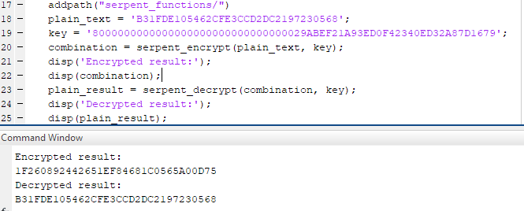

    
# Serpent algorithm step by step implementation in MatLab

The Serpent encryption algorithm was designed by Ross Anderson, Eli Biham and Lars Knudsen

Serpent encrypts 128 bits of plaintext P, in 128 bits of ciphertext C, a through 32 rounds controlled by 33 128-bit subkeys, named K{0..32}. The user password is variable, since one of the purposes is that the key can be handled with values between 128 and 256 bits.

## Serpent Cipher

The Serpent block cipher itself consists of:

 1. An initial permutation, called Per.
    
 2. 32 rounds of mixing, using round key mixing, S-boxes, and a linear
        transform. In the last round of replace the linear transformation
        for an additional mix of the round key.
   
 3. A final permutation, called Per – 1

## Requirements

- Matlab version: R2018b

## How to use it

A working example can be found in the main.m file

 1. Add the serpent_functions to use with:
` addpath("serpent_functions/")`
 2. Obtain the encrypted code by using :
 `combination = serpent_encrypt(plain_text, key);`
 Have in count that plain_text has to be the representation of 128 BITS, for example in HEX representation:
 `B31FDE105462CFE3CCD2DC2197230568`
 Use any key of 256 BITS for example in hex representation:
 `8000000000000000000000000000000029ABEF21A93ED0F42340ED32A87D1679`

To decipher use the same key and the output of the combination to get the initial value:
`plain_result = serpent_decrypt(combination, key);`

## ToDo
 - [ ] Example of use with images

## Author
* **David Orejuela** - [daorejuela1](https://github.com/daorejuela1)
